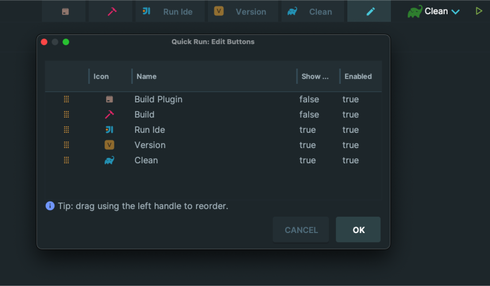

# Quick Run Toolbar

Quick Run Toolbar puts your favorite Run/Debug configurations right on the Main Toolbar as clickable buttons — one click to run, zero context switching.

## Features
- Buttons on the Main Toolbar (New UI and Classic UI).
- Pick which Run/Debug configurations appear.
- Reorder buttons with drag & drop.
- Optional text label per button (show/hide).
- Enable/disable per button without removing the configuration.
- Per‑project settings; non‑destructive (doesn’t modify your Run/Debug configurations).
- Works with any Run/Debug configuration type.
- Built‑in icon picker with search.

## Screenshots

[//]: # (![Icon picker and editor]&#40;docs/images/screenshot2.png&#41;)

[//]: # (![Reorder with drag & drop]&#40;docs/images/screenshot3.png&#41;)
[//]: # (![Run action in action]&#40;docs/images/screenshot4.png&#41;)

## Installation
- From the IDE:
  1. Open Settings/Preferences > Plugins.
  2. Search for “QuickRun” in the Marketplace, or choose “Install Plugin from Disk…” if you have a ZIP.
  3. Restart the IDE when prompted.

- Manual from sources:
  - Run the plugin in a sandbox IDE:
    - `./gradlew runIde`
  - Build a distributable ZIP:
    - `./gradlew buildPlugin` (the ZIP is placed under `build/distributions/`)

## Usage

### Show buttons on the Main Toolbar
After installation and restart, QuickRun appears on the right side of the Main Toolbar. Each button represents a Run/Debug configuration you selected.

- Click a button to run the associated configuration.
- If a label is enabled, it is shown next to the icon; otherwise the button is icon‑only.

### Configure which buttons are shown
Use the dedicated editor to select, order, and customize your buttons:

- Open Tools > Quick Run: Edit Buttons
  - Tip: You can also use “Find Action” (Ctrl+Shift+A on Windows/Linux, Cmd+Shift+A on macOS) and search for “Quick Run: Edit Buttons”.

In the editor dialog:
- Reorder rows using the drag handle to change button order.
- Click the Icon cell to choose an icon from the available set.
- Edit the Name cell to override the display label (optional).
- Toggle “Show Name” to show/hide the text label on the toolbar.
- Toggle “Enabled” to show/hide the button on the toolbar.

Press OK to save. The Main Toolbar updates accordingly.

### Notes
- Only existing, non‑temporary Run/Debug configurations are listed for selection.
- If a configuration is removed from the project, its button will automatically disappear.
- If you do not see the toolbar, ensure the Main Toolbar is visible (View > Appearance > Toolbar).

## Build from source
Requirements:
- JDK 17
- Gradle Wrapper (included)

Commands:
- Run in sandbox IDE: `./gradlew runIde`
- Build plugin ZIP: `./gradlew buildPlugin`

## Compatibility
- IDEs: IntelliJ IDEA (Community/Ultimate) and other IntelliJ‑based IDEs.
- IDE versions: 2024.1 (build 241) and newer.
- OS: Windows, macOS, Linux.

## Troubleshooting
- Toolbar not visible:
  - Ensure View > Appearance > Toolbar is enabled.
  - Restart the IDE after installing the plugin.
- Buttons not appearing:
  - Open Tools > Quick Run: Edit Buttons and ensure items are Enabled.
  - Verify the corresponding Run/Debug configurations still exist in your project.

## Support
If you find issues or have feature requests, please open an issue in your repository or share feedback via the IDE’s plugin details page.

## License
This project is licensed under the MIT License. See the [LICENSE](LICENSE) file for details.
